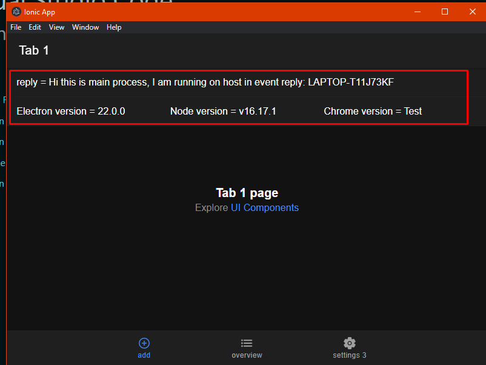
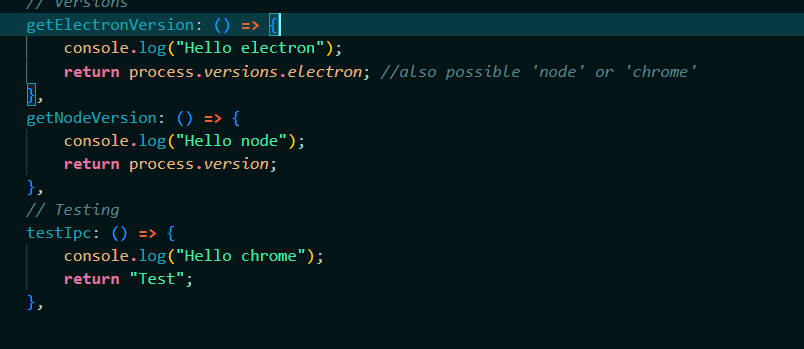

# Documentation Lab 3 - Killian Serluppens

## Description
- I made a turf application to control and view how many drinks you have bought
- It uses a form on the home page to fill it in, and you can view your turfs on the seconds page. I am planning to add a settings page zhere you can change it into dark mode but i have not completeted that at the time of writing

## Intro
- For My GUI i used the tabs templated from ionic
- I reused some code of my 2nd lab but I redit andchanged some parts
  - Like a new form and a added code for an overview page

## Steps Followed

### Step 1 - Instalation
- For the instalation proses I used the documentation on canvas. I did have a problem when i want to use electron auto-reload (npm start / ionic serve)
  - In the tutorial you have to at './' to the index.html page in the base tag. when i use this i get a MIME error. 
  - So i deleded this and wrote just '/' when i am desinign the UI

### Step 2 - UI
- The UI is simple
  - I have 3 pages (tabs)
  - i used the tab templated from ionic
  - the home page (tab1) is the page where the form is and where you can fill in a turf
  - the overview page (tab2) is the oage where you can view all of your turfs
  - the settings page (tab3) is where you can change some settings

### Step 3 - IPC 
- This setp is adding IPC to the project
#### Setting up
  - I had some struggel while setting up the IPC stuff and following the the theacher's document. I got an referense ERROR. so i started looking for a solution. i tried a lot but nothing realy worked or it would make the app les secure.
  - 
  - so i kept following the tuttorial and now i still have the error. BUT my IPC works. I the code given woreks and i tried adding a few simple things myself and they work to.  
  - **IPC in the app**
  - 
  - **The code**
  - 
- 

## What changed?

## Link to theory
### How secure is my application?
  - https://stackoverflow.com/questions/66913598/ipcrenderer-on-is-not-a-function
  **TODO** Read this and write about it.
  - While i was lookup up stuff about electron and researching i got a found some articles and tutorials about hackling electron with http and other 3rd party programs. this was a little conserning to me.

## Screenshots of working app:

## Conclusion