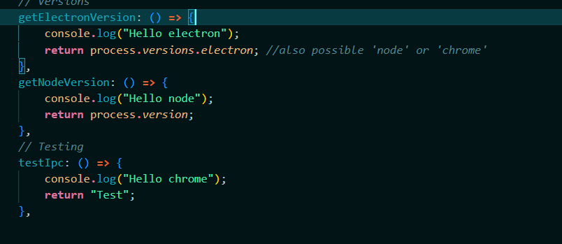

 Documentation Lab 3 - Killian Serluppens

## Description
- I made a turf application to control and view how many drinks you have bought
- It uses a form on the home page to fill it in, and you can view your turfs on the seconds page. I am planning to add a settings page zhere you can change it into dark mode but i have not completeted that at the time of writing
- THe settings tab is empty. I wanted to use this to do some extra work but did not get there

## Intro
- For My GUI i used the tabs templated from ionic
- I reused some code of my 2nd lab but I redit andchanged some parts
  - Like a new form and a added code for an overview page
- I have 2 IPC function. 1 for validation and 1 for opening a new webpage
- the nodJS does not work i got an error on startup and did not find a sollution (tried to use fileSystem from NodeJs)


## Steps Followed

### Step 1 - Instalation
- For the instalation proses I used the documentation on canvas. I did have a problem when i want to use electron auto-reload (npm start / ionic serve)
  - In the tutorial you have to at './' to the index.html page in the base tag. when i use this i get a MIME error. 
  - So i deleded this and wrote just '/' when i am desinign the UI

### Step 2 - UI
- The UI is simple
  - I have 3 pages (tabs)
  - i used the tab templated from ionic
  - the home page (tab1) is the page where the form is and where you can fill in a turf
  - the overview page (tab2) is the oage where you can view all of your turfs
  - the settings page (tab3) is where you can change some settings

### Step 3 - IPC 
- This setp is adding IPC to the project
#### Setting up
  - I had some struggel while setting up the IPC stuff and following the the theacher's document. I got an referense ERROR. so i started looking for a solution. i tried a lot but nothing realy worked or it would make the app les secure.
  - 
  - so i kept following the tuttorial and now i still have the error. BUT my IPC works. I the code given woreks and i tried adding a few simple things myself and they work to. <br>
  - **IPC in the app**
  - 
  - **The code**
  - 
  
#### IPC - Validation
  - I did my form validation with IPC.
  - When u press the submit button it will go to the typescript function anmd check if it is valid
  - depending on the validation result it will send an errorcode to a function in de preloadf (integer). in the preload function it will ditermen what error / succes message it will return occording to the errocode.

#### IPC - Webpage of product
  - in the overview page when u press on the product (IceTea or cola) it will open a new window and show the productpage of that prodct
  - It can happen that your page stays white for a fwew seconds. this is because the page is loading. this takes a while (on my machine)
  - see screen for proof it works

### Step 4 - IPC Api Call
- i tried to use the fileSysten toik with the Nodejs promise API
- https://nodejs.org/api/fs.html#class-filehandle
- When i try to import 'fs' it give me erros on startup of the application and i cannot write files. i dont why this is happening.
- 


## What changed?

## Link to theory
### How secure is my application?
  - https://stackoverflow.com/questions/66913598/ipcrenderer-on-is-not-a-function
  **TODO** Read this and write about it.
  - While i was lookup up stuff about electron and researching i got a found some articles and tutorials about hackling electron with http and other 3rd party programs. this was a little conserning to me.

**1. Only load secure content:**
   1. I used only 2 links and thet both use https. (productpage IPC)

**2. Disable the Node.js integration in all renderers that display remote content**
   1. According to electron docs. this is in default behavior since 5.0.0., My electron is in version 22.0.0
   2. 
   3. They also talk about 'enableling Node.js integrations i did not realy know what this was so i looked this up and read this article: <br>
   https://medium.com/@gracespletzer/disabling-node-integration-for-electron-applications-8b45f0fa0fd9
   4. This makes a send list what channels are allawed so there cannot be remote channels.
   5. So  followed the article and tried to implement it but then i get this error:
   6. 
   7. Code:
   8. 
   9. 
   10. i did not add the request code becaue i did not use it.
   11. I tried to implement this but this did not work sadly. so this makes my application less secure

**3. Enable context isolation in all renderers**
  - According to the doc this recomendation is in the default behavior in electron 12.0.0 + i am in 22.0.0
**4. Enable process sandboxing**
  - i added 'sandbox: true,' in the webprefrences contructor to enable sanboxes.
   
**5. Use ses.setPermissionRequestHandler() in all sessions that load remote content**
  - THis is about how the permissions the user has to manually accept like, notification, use of popups, cookies, etc
  - i do not use this in my application.

**6. Do not disable webSecurity**
  - This is electron's Default according to the doc.
  - i also dit not disable it so this should not be a worry.
  - if you want to dissable it you have to add this to your new browserWIndow obj:
  - 'new BrowserWindow({webPreferences: {webSecurity: false}});'

**7. Define a Content-Security-Policy and use restrictive rules (i.e. script-src 'self')**
  - this adds an aditional securety layer to the application to prevent cross-sitte scripting attacks/data injection.
  - I tried to use the CSP Meta taf in my project to add some securety but got some errors and did not really unbderstand it fully 100%
  - so i tried to follow a tutorial on stackoverflow but that did not work aswel:
  - thios also made my styling not work
  - https://stackoverflow.com/questions/30280370/how-does-content-security-policy-csp-work
  - ```<meta http-equiv="Content-Security-Policy" content="default-src 'self'; style-src 'self';script-src 'self';connect-src 'self'">```
  - 
  - This is probably because i wrote it wrong and did not gave it the right amount of permissions.

**8. Do not enable allowRunningInsecureContent**
  - This is electron's Default according to the doc.
  - But if you set: ```allowRunningInsecureContent```  to true it will be disabled
  - To be shure i it was set to false i put the following code in my project
  - ```allowRunningInsecureContent: true, ```

**9.  Do not enable experimental features**
  - Again this is desabled by electron on default
  - Again you can enable this by adding this code ``` experimentalFeatures: true```
  - just like in 8. i set this to fasle to be sure

**10.  Do not use enableBlinkFeatures**
  - This is also desabled by default
  - To enable this add ```     enableBlinkFeatures: 'ExecCommandInJavaScript' ``` to main.js (index.js for me)
  - to do this the good way do it like this:
  ```js
  // code from index.js/101 
  const win = new BrowserWindow({ width: 1200, height: 1000 })
  ```

**11.  <webview>: Do not use allowpopups**
  - recomendation again by default
  - I am not using webview so this is not relevent to my application

**12.  <webview>: Verify options and params**
  - to be sure the webPreferences do not disable securety features you can control the creating of new ```<webview>`` tags
  - I used the code givin in the docs and added it to index.js
  ```js
    app.on('web-contents-created', (event, contents) => {
    contents.on('will-attach-webview', (event, webPreferences, params) => {
      // Strip away preload scripts if unused or verify their location is legitimate
      delete webPreferences.preload

      // Disable Node.js integration
      webPreferences.nodeIntegration = false

      // Verify URL being loaded
      if (!params.src.startsWith('https://example.com/')) {
        event.preventDefault()
      }
    })
  })
  ```

**13. Disable or limit navigation**
  - becasue i only navigate to 3 pages i will use the following code:
  ```js
    const URL = require('url').URL

    app.on('web-contents-created', (event, contents) => {
      contents.on('will-navigate', (event, navigationUrl) => {
        const parsedUrl = new URL(navigationUrl)

        if (parsedUrl.origin !== 'https://example.com') {
          event.preventDefault()
        }
      })
    })
  ```

**14. Disable or limit creation of new windows**
  - According to the docs:
  - the webcontents will delegat to its new open handler before creating new windowas. it will get a url parameter and other paramets
**15. Do not use shell.openExternal with untrusted content**
  - I dont use SHell.openExternal
  - if i used this it could lead to leveraged compromises in the users host.
**16. Use a current version of Electron**
  - version 22.0.0
**17. Validate the sender of all IPC messages**
  - tried to include the code from the docs but got this error:
  - 


# **Screenshots of working app:**

# Validation
 <br><br>
 <br><br>
 <br><br>
<br><br>

# Product webpage
<br><br>

# UI
<br><br>
<br><br>


# Conclusion

- When i started to do some research for electron  i came a lot of negative reviews. Peaplea saying that electron was bad and should not be used so i started with a bad feeling and a bit scared.
- once i started i understood why. Installing and getting everything to work was a bit hard but becasue of the given tutorial/documentation by the teacher it whent ok.
- understanding IPC was also a bit difficult. it was confusing because I used ionic and most of the tutorials online are only in .js.
- Saddly as a said eearlier. trying to use a Node.js API call caused errors. and i did not find out in time how. (code still in commentary).
- The security part was quite interesting. In the courses i had following yewars in TM we never really accounted for securety or really smal like validation and anti sql injection, but never this big and extensive. So that was really interesting about this course and will keep the securety in mind for my next courses.